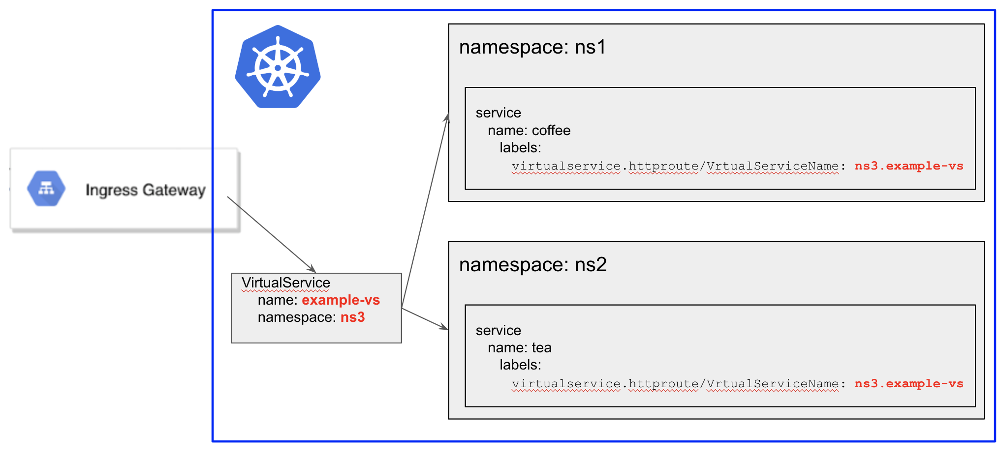

> The base of this repo was originally forked from github.com/trstringer/k8s-controller-core-resource

# virtual-service-routes-controller
update istio virtual services dynamically by service events 

## What is this?

This is a custom Kubernetes controller for the purpose of watching services with label `virtualservice.httproute/VirtualServiceName`, which conatains the virtual service metadata for updating route rules to apply based on serive changes and easily control the flow of traffic. The label value uses the format `<virtualservice-namespace>.<virtualservice-name>`


## Usage



As you can see above, for example we have 2 different services with the same virtual service metadata value. The custom controller get those services and update the route rules by the example below.
The Uri prefix will be `/<service-namespace>/<service-name>` and the route destination will the service fqdn.

```yaml
---
apiVersion: networking.istio.io/v1alpha3
kind: VirtualService
metadata:
  name: example-vs
  namespace: ns3
spec:
  gateways:
  - example-gateway
  hosts:
  - "*"
  http:
  - headers:
      response:
        remove:
        - x-envoy-upstream-healthchecked-cluster
        - x-envoy-upstream-service-time
    match:
    - uri:
        prefix: /ns1/coffee
    rewrite:
      uri: /
    route:
    - destination:
        host: coffee.ns1.svc.cluster.local
        port:
          number: 80
  - headers:
      response:
        remove:
        - x-envoy-upstream-healthchecked-cluster
        - x-envoy-upstream-service-time
    match:
    - uri:
        prefix: /ns2/tea
    rewrite:
      uri: /
    route:
    - destination:
        host: tea.ns2.svc.cluster.local
        port:
          number: 80
```